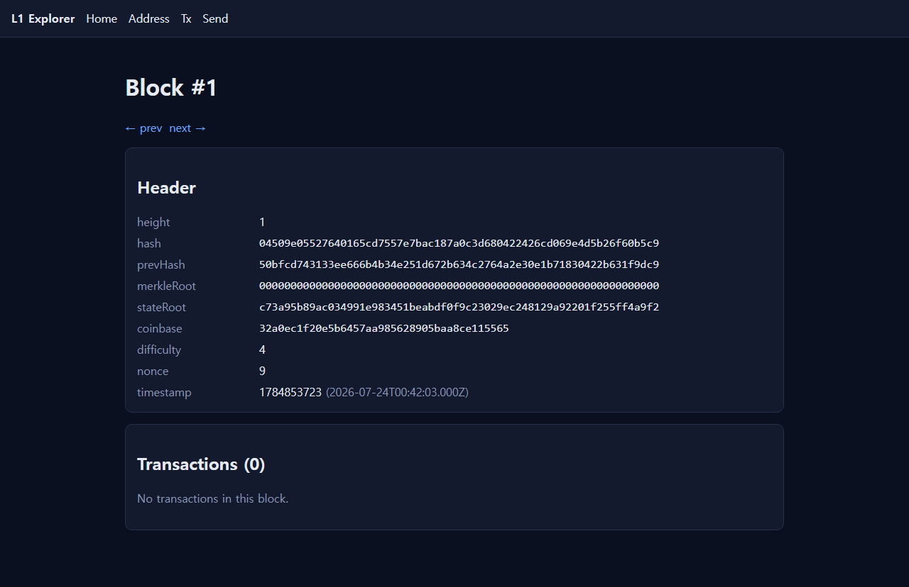
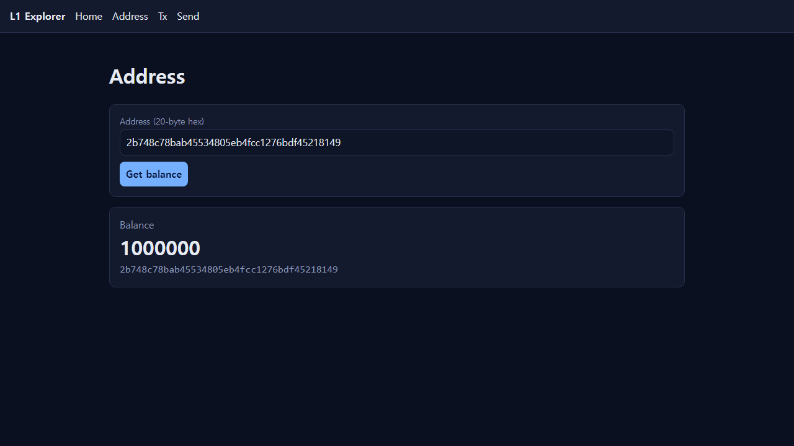
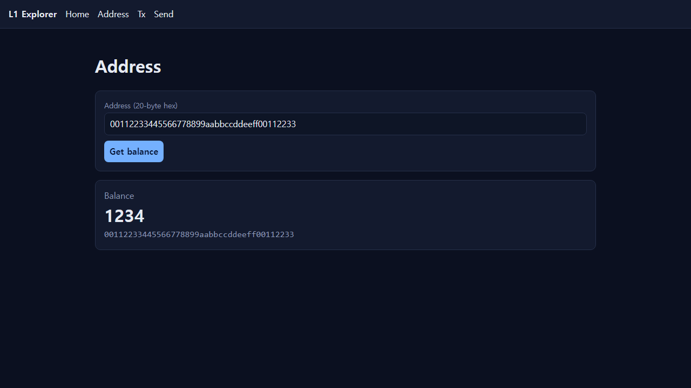

# l1chain — a from-scratch Layer-1 blockchain in Go

[](https://github.com/ITJHIT/l1chain_JIHO/actions/workflows/ci.yml)
[](go.mod)
[](#license)

A learning/portfolio Layer-1 blockchain built from first principles in Go: Proof-of-Work consensus, an account-based native coin, real libp2p peer-to-peer networking, a custom stack VM, an embedded EVM that runs standard ERC-20 contracts, a JSON-RPC node, a CLI wallet, and a React/Next block explorer.

Every component is implemented from scratch (not a fork), test-covered, and adversarially red-teamed.

```
┌────────────────────────────────────────────────────────────────────┐
│  cmd/l1 (CLI + node daemon)      web/ (Next.js block explorer)      │
│        │  JSON-RPC (rpc/)              │  same-origin /api/rpc proxy │
│        ▼                               ▼                             │
│  node/  ── mempool · miner · RWMutex-guarded state access           │
│    │                                                                │
│    ├── chain/     block linkage · longest-chain reorg · state trans.│
│    ├── consensus/ PoW · difficulty retarget (~10s)                  │
│    ├── p2p/       libp2p host · gossipsub · /l1/sync stream          │
│    ├── vm/        custom stack VM (gas, storage, CALL)   [M3]        │
│    ├── evm/       embedded go-ethereum EVM · ERC-20      [M4]        │
│    ├── state/     StateDB abstraction (KV → MPT-ready)              │
│    ├── store/     BoltDB persistence                               │
│    ├── wallet/    secp256k1 keys · sign · verify                   │
│    └── core/      block · tx · merkle · hash · address             │
└────────────────────────────────────────────────────────────────────┘
```

## Screenshots

The Next.js block explorer (`web/`), driven by the JSON-RPC node:

| Block view | Address balance | Browser-signed send |
|---|---|---|
|  |  |  |

_The "Browser-signed send" shot shows a recipient credited 1234 by a transaction signed entirely in the browser (secp256k1 via `@noble`) and accepted verbatim by the Go node's verifier._

## Milestones

| Milestone | Scope | Status |
|-----------|-------|--------|
| **M1** | Block/tx/merkle, account coin, PoW + difficulty, longest-chain reorg, secp256k1 wallet, BoltDB persistence, JSON-RPC, CLI | ✅ done |
| **M2** | Real libp2p P2P (gossipsub + stream sync), multiprocess/LAN 3-node convergence + partition re-convergence, React/Next block explorer with in-browser signing | ✅ done |
| **M3** | Custom stack VM: gas metering, contract deploy/call, journaled storage, deterministic mining==validation | ✅ done |
| **M4** | EVM compatibility (hybrid): B2 subset-from-scratch (M3) + B1 embedded go-ethereum `core/vm` running a real ERC-20 over keccak/MPT state | ✅ done |

## Features

- **Consensus** — Bitcoin-style Proof-of-Work with leading-zero-bit targets, difficulty retargeting toward a ~10s block interval, and longest-(heaviest-)chain reorg with full state replay.
- **Native coin** — account/balance model, ECDSA secp256k1 signatures, genesis allocation, fixed block reward (coinbase credited into canonical state), infinite supply.
- **P2P** — real `go-libp2p` hosts over TCP, GossipSub for block/tx propagation, a `/l1/sync/1.0.0` stream protocol for catch-up sync, bounded (deadlines + size caps) against slow/malicious peers. Blocks from the network are **never trusted** — every one is re-validated through `chain.AddBlock`.
- **Smart contracts** — a from-scratch stack VM (M3) with Ethereum-numbered opcodes, gas, out-of-gas revert, and CALL depth limits; plus an embedded go-ethereum EVM (M4) that deploys and runs a standard ERC-20 with keccak-derived mapping storage.
- **Tooling** — JSON-RPC (`getChainHead`, `getBlockByHeight`, `getBalance`, `sendRawTx`, `getTxByHash`), a CLI (`wallet`/`balance`/`send`/`node`), and a Next.js explorer with **in-browser secp256k1 signing** (a browser-signed tx is accepted verbatim by the Go verifier).

## Quickstart

Requires Go 1.26+ and Node 18+.

```bash
# build
go build ./cmd/l1

# run a mining node with an RPC endpoint
go run ./cmd/l1 node --rpc-addr 127.0.0.1:8545 --mine-interval 2s --difficulty 8

# in another shell: wallet + queries
go run ./cmd/l1 wallet new
go run ./cmd/l1 balance --addr <hex> --rpc http://127.0.0.1:8545
go run ./cmd/l1 send --key <priv-hex> --to <addr> --value 100 --rpc http://127.0.0.1:8545
```

### Multi-node (real libp2p)

```bash
# node 1 (miner) — prints its own /p2p/<id> multiaddr on startup
go run ./cmd/l1 node --rpc-addr 127.0.0.1:8545 --listen 4001 \
  --genesis-timestamp 1750000000 --mine-interval 2s --difficulty 8

# node 2 — dials node 1, shares the same --genesis-timestamp
go run ./cmd/l1 node --rpc-addr 127.0.0.1:8546 --listen 4002 \
  --genesis-timestamp 1750000000 --peers /ip4/127.0.0.1/tcp/4001/p2p/<node1-id>
```

### Block explorer

```bash
cd web
npm install
NEXT_PUBLIC_RPC_URL=http://127.0.0.1:8545 npm run dev   # http://localhost:3000
```

## Testing

```bash
go vet ./...
go test ./...          # 13 packages, unit + integration + determinism
cd web && npx playwright test   # explorer + browser-signed send E2E
```

Each milestone was adversarially red-teamed; the reports live in [`artifacts/`](artifacts/):

- `m1-redteam-report.json` — double-spend, replay, forgery, invalid PoW, tampered roots, deep-reorg no-leakage, overflow, coinbase tampering
- `m2-p2p-redteam-report.json` — invalid/forged/tampered gossip, malicious sync responder, replay flood, orphan, junk payload
- `m3-vm-redteam-report.json` — infinite loop OOG, stack under/overflow, invalid jumps, storage isolation, reentrancy bounds, determinism
- `m4-evm-redteam-report.json` — OOG deploy/call, revert integrity, gas-bounded loops, reentrancy, deterministic MPT root

## Design notes

- **Determinism is consensus-critical.** Mining and validation compute block state roots through the *identical* derivation path (replay from genesis, sorted map-free hashing, no wall-clock/randomness). Contract execution (M3) and the state root fold are deterministic so every node agrees.
- **StateDB is an interface** (`state/StateDB`) so the M1 KV model can be swapped for a Merkle-Patricia-Trie without touching block validation, RPC, or the VM — the seam M4's EVM state uses.
- **The EVM (M4) is an execution capability**, cleanly isolated from chain consensus (nothing imports `l1chain/evm`). Full opcode/precompile/MPT byte-for-byte chain-consensus equivalence is a documented long-term goal.

## Hardening (post-M4)

Implemented on top of the milestones:

- **Gossip topic validators** — invalid-PoW / bad-merkle blocks and forged-signature txs are rejected before network propagation (anti-amplification), on top of application-time re-validation.
- **mDNS LAN discovery** (`--mdns`) — nodes on the same network auto-discover and connect without explicit `--peers`.
- **Transaction chain-id** — a `ChainID` is folded into the signing preimage, so a tx signed for one chain cannot be replayed on another; enforced identically on the mining and validation paths (`ErrBadChainID`).
- **Bounded mempool** — configurable size cap with a reject-when-full policy (`ErrMempoolFull`).
- **String-encoded amounts on the wire** — large `uint256`/`uint64` fields are decimal strings in JSON-RPC (and the browser signer), avoiding JS `Number` precision loss above 2^53.

Still deferred (heavier / environment-bound):

- Real-internet NAT traversal: DHT peer discovery + AutoNAT/relay (mDNS covers LAN; internet relay untested in the sandbox).
- EVM: run solc-compiled OpenZeppelin contracts, event logs, precompiles; promote the canonical chain StateDB to MPT/keccak for byte-for-byte consensus equivalence.

## License

MIT (learning/portfolio project — not audited, not for production value).
